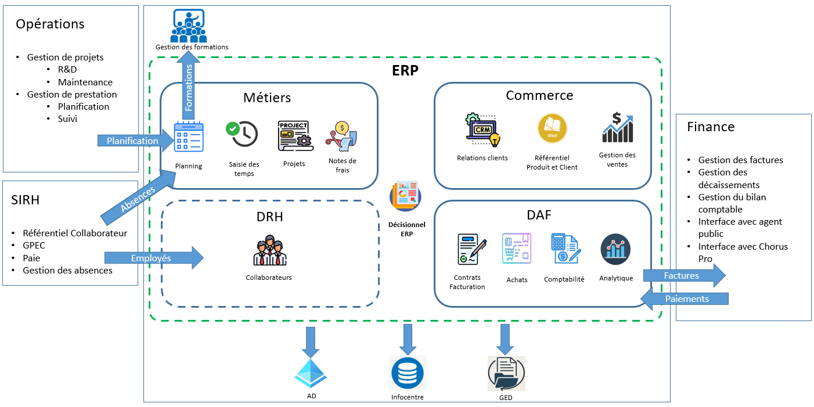

# 🏢 Intégration d’un ERP dans une organisation multi-métier (300+ collaborateurs)

Ce dépôt documente la mise en place d’un ERP dans une organisation de plus de 300 personnes, couvrant un périmètre allant du commerce à la facturation, en passant par la gestion des achats, prestations, formation et le suivi de l’activité des collaborateurs.

Le projet a impliqué une refonte profonde des processus, une intégration technique complète au SI existant, et un accompagnement fort des utilisateurs.

## 🎯 Objectifs du projet

- Refondre les processus métiers autour d’un ERP centralisé, en remplacement d’une multitude d’applications métiers en silo, peu communicantes
- Intégrer l’ERP comme nouveau socle du système d'information
- Développer des interfaces internes robustes et sécurisées
- Accompagner les utilisateurs dans l’appropriation de l’outil

## 🧱 Périmètre couvert

Le périmètre du projet couvre l’ensemble des fonctions clés de gestion de l’organisation, depuis les processus commerciaux jusqu’au pilotage administratif et opérationnel, dans une logique d’intégration et de simplification du système d’information :

👉 [Voir le détail du périmètre fonctionnel](docs/perimetre-fonctionnel.md)

## 🗺️ Étapes du projet

Le projet a été structuré en plusieurs phases clés, depuis la phase de recherche de solution jusqu'à la mise en production :

👉 [Voir le détail des étapes du projet](docs/etapes-projet.md)

## ⚙️ Intégration SI

L’intégration du nouvel ERP avec l’existant repose sur une architecture d’échanges inter-applicatifs conçue pour garantir la cohérence des données, la fluidité des processus et la pérennité du système d’information.

👉 [Voir le detail des flux inter applicatifs](docs/flux-si.md)

## 🤝 Conduite du changement

La conduite du changement a été un levier essentiel de réussite pour garantir l’adhésion des équipes au nouvel ERP. Elle s’est articulée autour de plusieurs axes complémentaires :

- Sessions de formation ciblées, adaptées aux profils métiers
- Création d’ateliers dédiés aux différents acteurs pour définir leurs contributions dans le nouveau système
- Assistance personnalisée à la reprise des données depuis les anciens outils
- Formation interne des key users pour en faire des relais opérationnels
- Mise à disposition de supports utilisateurs pédagogiques
- Suivi de l’adoption post-déploiement avec points réguliers et ajustements continus

