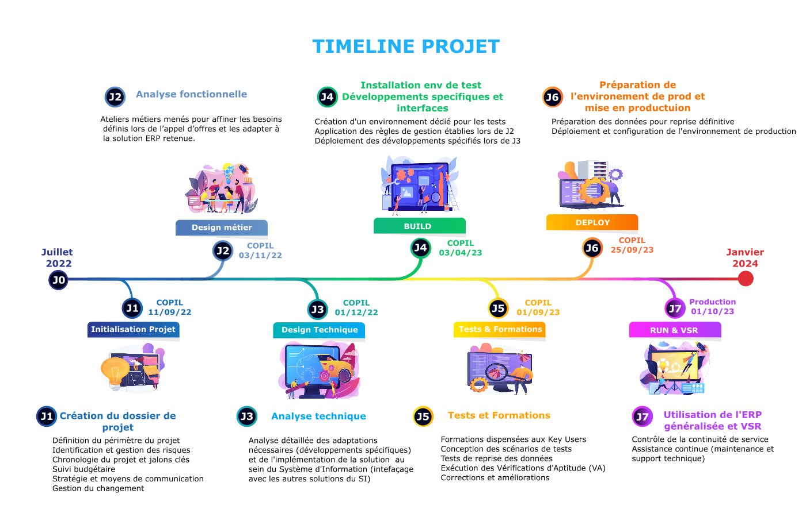

# 🗺️ Étapes clés du projet ERP

Le projet de mise en œuvre de l'ERP s'est structuré autour de plusieurs phases clés, illustrées dans la timeline ci-dessous :

## Phases du projet ERP

- **J0 – Avant-projet**  
  Audit interne du SI et des processus métiers. Définition du **MVP** (priorisation des besoins), organisation de démonstrations de solutions spécialistes et généralistes basées sur des scénarios métier. Rédaction de l’appel d’offres (**CCAP/CCTP**), dépouillement des propositions et choix de la solution validé par le **CODIR**.  

- **J1 – Initialisation du projet**  
  Cadrage global du projet, définition de la gouvernance (**COPIL/CODIR**), mise en place de la gestion des risques, des jalons clés et des indicateurs de suivi.  

- **J2 – Analyse fonctionnelle**  
  Animation d’**ateliers métiers** pour formaliser les besoins (commerce, métiers, RH, facturation). Consolidation et validation des exigences par les **key users**.  

- **J3 – Analyse technique**  
  Étude d’architecture du SI, conception des interfaces et interconnexions, spécifications des développements spécifiques. Coordination entre équipes IT et métiers pour assurer l’alignement fonctionnel et technique.  

- **J4 – Développements & environnement de test**  
  Mise en place du **socle technique** et des environnements de développement/test. Suivi des développements, intégrations et pilotage de la qualité technique.  

- **J5 – Tests & Formations**  
  Organisation des recettes fonctionnelles. **Formation des utilisateurs clés**, transfert de compétences et accompagnement méthodologique des équipes internes pour renforcer leur autonomie.  

- **J6 – Préparation de la production**  
  Reprise et migration des données, configuration finale, gestion documentaire et validation technique avant bascule en production.  

- **J7 – Mise en production & VSR**  
  Passage en production et accompagnement des métiers. Animation des comités de suivi, supervision de la phase de **Vérification de Service Régulier (VSR)**, gestion des écarts et plan d’amélioration continue.  

---

## Résultats clés

- Adoption rapide par les métiers grâce à une implication des les prémices du projet.   
- **+30 % de productivité** sur le traitement des commandes.  
- Meilleure **traçabilité et sécurité** du SI.  
- Réduction des erreurs opérationnelles et fiabilisation des flux.  
- Montée en compétences des équipes internes grâce au transfert méthodologique.  

🔙 [Retour au README principal](../README.md)
