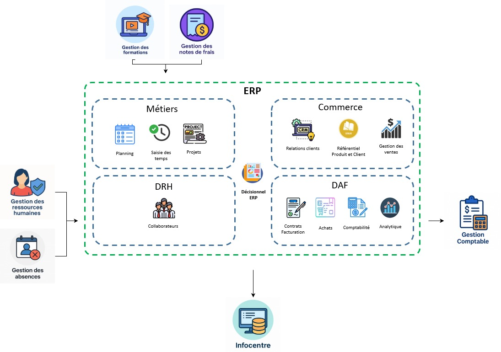

# 🔄 Flux d'intégration avec le SI existant

L'intégration de l'ERP dans le système d'information repose sur un ensemble d'interfaces structurées permettant de garantir la cohérence des données, la continuité des processus métiers, et l’interopérabilité entre les applications existantes.

## 🧩 Principaux flux inter-applicatifs

Voici les principaux flux de données identifiés entre l’ERP et les systèmes tiers :

## 🖼️ Illustration des flux

- **Gestion des absences** ⟶ ERP  
  Synchronisation des absences saisies dans le logiciel RH pour prise en compte dans les temps projets et la facturation.

- **Gestion des collaborateurs** ⟷ ERP  
  Échange bidirectionnel pour maintenir à jour les données RH de base (identité, statut, affectation).

- **Gestion des formations** ⟶ ERP  
  Mise à disposition des données de formation pour suivi dans les projets et calculs d’indicateurs RH.

- **ERP ⟶ Infocentre**  
  Alimentation d’un entrepôt de données décisionnel pour la production de tableaux de bord consolidés.

- **ERP ⟶ Comptabilité**  
  Génération automatique des écritures comptables issues des ventes, achats, et traitements analytiques.

Ces flux ont été modélisés selon des standards de type ETL/API/FTP selon les systèmes sources, avec une attention portée à la supervision, à la traçabilité et à la résilience.

---

🔙 [Retour au README principal](../README.md)
