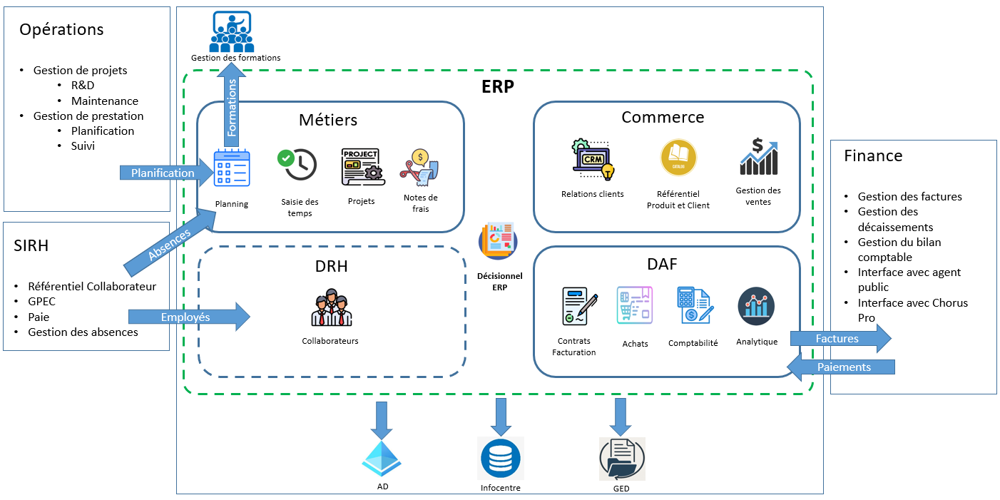

## 🖼️ Schéma d’architecture

Voici une vue d’ensemble de l’intégration de l’ERP dans le système d’information :

# 🎯 Présentation du périmètre fonctionnel

Le projet ERP vise à mettre en place un **nouveau socle de gestion intégré**, couvrant l’ensemble des processus métier clés de l’organisation, de la relation client jusqu’à la facturation, en passant par la gestion des projets et des achats.  
Ce socle centralise les données de gestion, remplace des outils hétérogènes devenus obsolètes, et facilite les échanges inter-applicatifs avec le système d'information existant.  
Il constitue une réponse stratégique à la croissance de l’organisation et à l’évolution de ses pratiques.

Le périmètre est structuré en deux lots :
- **Lot 1 (MVP)** : Mise en œuvre des fonctions de base de l’ERP, de la gestion des référentiels à la comptabilité.
- **Lot 2 (optionnel)** : Déploiement progressif de modules complémentaires, selon les besoins.

